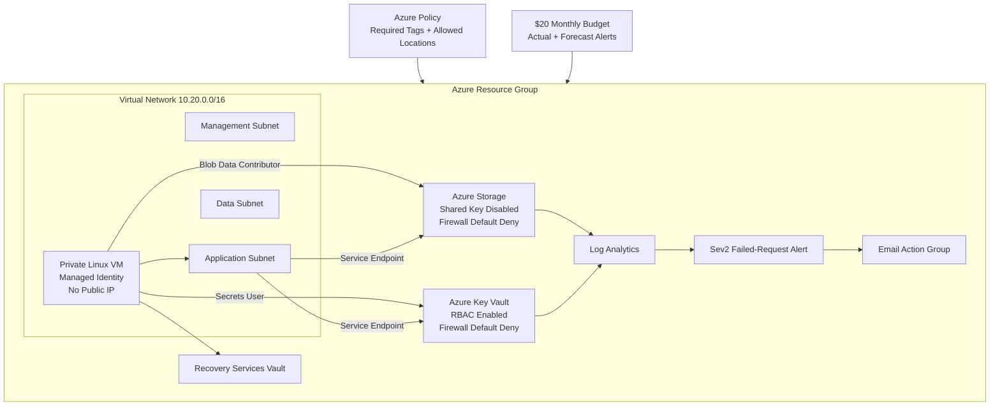

# Secure Azure Enterprise Foundation

A security-focused Azure environment deployed with **Bicep Infrastructure as Code**.

This project demonstrates practical Azure administration and cloud-security skills, including governance, network segmentation, managed identities, centralized monitoring, automated alerting, cost controls, backup protection, and tested recovery.

## Project Results

| Area | Result |
|---|---|
| Infrastructure deployment | Passed |
| Azure Policy enforcement | Passed |
| Managed-identity access | Passed |
| Storage and Key Vault security | Passed |
| Centralized diagnostic logging | Passed |
| Live security alert | Fired and emailed successfully |
| Azure VM backup | Healthy |
| Live recovery drill | Restored successfully |
| Final Bicep What-If | No Create or Delete actions |
| Temporary resources | Removed |
| Project VM | Deallocated for cost control |

## Architecture



## Security Controls

| Control | Implementation |
|---|---|
| Infrastructure as Code | Modular Azure Bicep deployment |
| Governance | Required `Environment` tag and approved-region policy |
| Network isolation | Private VM with no public IP |
| Segmentation | Separate management, application, and data subnets |
| Workload identity | System-assigned managed identity |
| Least privilege | Key Vault Secrets User and Storage Blob Data Contributor |
| Storage protection | HTTPS-only, TLS 1.2, Shared Key disabled, firewall default Deny |
| Key Vault protection | RBAC, soft delete, purge protection, firewall default Deny |
| Monitoring | Storage and Key Vault logs sent to Log Analytics |
| Alerting | Sev2 scheduled-query alert with email notification |
| Recovery | Azure VM Backup with a successfully tested disk restore |
| Cost control | Monthly budget, VM deallocation, and test-resource cleanup |

## Live Validation Highlights

The project was tested rather than only deployed.

- An untagged resource was denied by Azure Policy.
- A resource in an unauthorized Azure region was denied.
- The VM accessed Key Vault and Blob Storage without passwords, keys, or SAS tokens.
- Unauthorized public requests to Key Vault and Storage were blocked.
- Key Vault and Storage activity appeared in Log Analytics.
- A failed Key Vault request triggered a real Sev2 Azure Monitor alert.
- The action group successfully delivered the alert email.
- Azure Backup restored a healthy 30 GB Linux OS disk from a recovery point.
- The restored disk was validated and all temporary restore resources were deleted.
- The final Bicep What-If reported zero Create and zero Delete actions.

See the full [Security Validation Report](docs/validation-report.md).

## Technologies

- Azure Bicep
- Azure CLI
- PowerShell
- Azure Policy
- Azure RBAC
- Managed identities
- Virtual networks and NSGs
- Azure Storage
- Azure Key Vault
- Log Analytics and KQL
- Azure Monitor alerts
- Azure Backup
- Azure Cost Management

## Repository Structure

```text
infra/
├── main.bicep
├── modules/
│   ├── backup.bicep
│   ├── compute.bicep
│   ├── cost-management.bicep
│   ├── governance.bicep
│   ├── governance-assignment.bicep
│   ├── monitoring.bicep
│   ├── network.bicep
│   └── services.bicep
└── parameters/
    └── dev.bicepparam

scripts/
└── validate-managed-identity-access.sh

docs/
└── validation-report.md
```

## Deploy

```powershell
az bicep build --file 'infra\main.bicep'

az deployment sub what-if `
  --location 'eastus' `
  --parameters 'infra\parameters\dev.bicepparam'

az deployment sub create `
  --name 'secure-azure-enterprise-foundation' `
  --location 'eastus' `
  --parameters 'infra\parameters\dev.bicepparam'
```

## Skills Demonstrated

Azure administration, cloud governance, network security, identity and access management, Infrastructure as Code, security monitoring, incident detection, cost management, backup, disaster recovery, validation testing, and technical documentation.

> This repository should not contain credentials, private keys, personal email addresses, subscription IDs, tenant IDs, SAS tokens, or managed-identity object IDs.